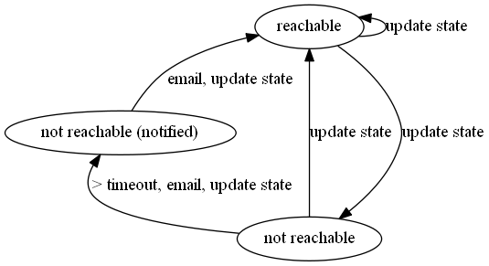

# systemd-ipv6-check

Checks for IPv6 connectivity and notifies via e-mail after a grace period of
unreachability.



## Command line options

```
ipv6-check [-s STATEFILE] [-h HOST] [-r RECIPIENTS] [-t TIMEOUT]

Check IPv6 connectivity by pinging a host, and optionally send email on connectivity change.

Options:
-s	Specify state file, default: /var/cache/ipv6-check/ipv6-check.state
-h	Specify host to ping, default: google.de
-r	Space-separated list of email recipients, default: root
-t	Time in minutes to wait before sending notification after IPv6 becomes unreachble, default: 30

```
